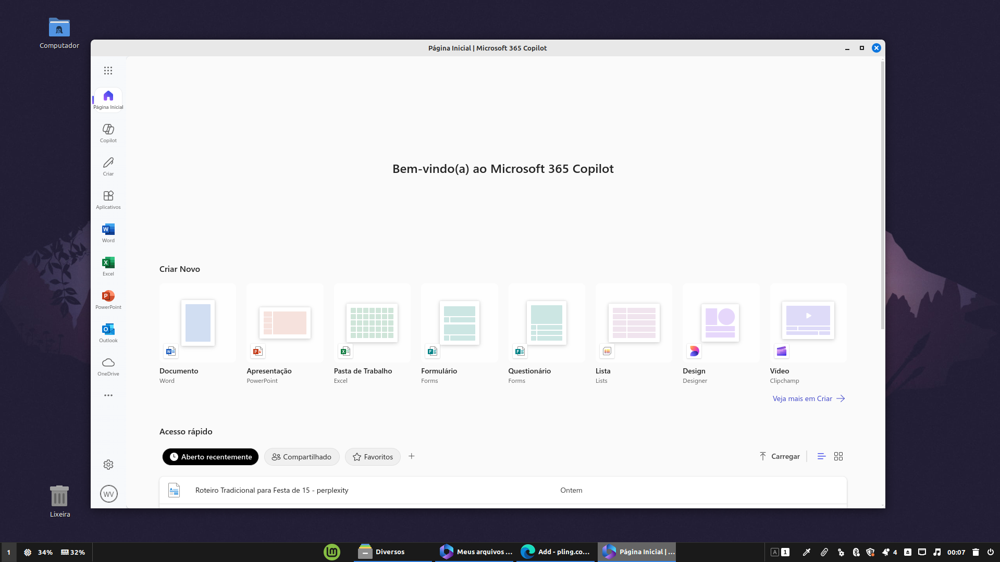

# Sobre a aplicação

Aplicação desenvolvida usando Electron. Empacotada usando AppImageTools. Ela basicamente abre a tela de login do Microsoft Office 365.

1. Baixe o arquivo Microsoft_Office_365_AppImage_20250516-21h55 Latest.
2. Descompacte-o e abra a pasta extraída.
3. Torne o arquivo Instalar.sh executável e o execute.
4. O aplicativo foi instalado com sucesso.
5. Apague a pasta Microsoft-Office-365-AppImage-20250516-21h55 e o arquivo Microsoft-Office-365-AppImage-20250516-21h55.zip, pois não são mais necessários.

Vídeo ensinando a instalar:
https://youtu.be/DAcmosUJKyM

---

# About the application

Application developed using Electron. Packaged using AppImageTools. It basically opens the Microsoft Office 365 login screen.

1. Download the Microsoft_Office_365_AppImage_20250516-21h55 Latest file.
2. Unzip it and open the extracted folder.
3. Make the file Instalar.sh executable and execute it.
4. The application has been installed successfully.
5. Delete the Microsoft-Office-365-APPIMAGE-20250516-21H55 folder and the Microsoft-Office-365-APPIMAGE-20250516-21H55.zip file, as they are no longer necessary.

Video showing how to install:
https://youtu.be/DAcmosUJKyM
