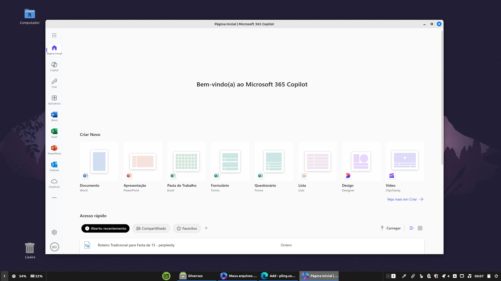

# Sobre a aplicação

Aplicação desenvolvida usando Electron. Empacotada usando AppImageTools. Ela basicamente abre a tela de login do Microsoft Office 365.

1. Baixe o arquivo Microsoft_Office_365_AppImage_20260313-08h50 Latest.
2. Descompacte-o e abra a pasta extraída.
3. Torne o arquivo Instalar.sh executável e o execute.
4. O aplicativo foi instalado com sucesso.
5. Apague a pasta Microsoft_Office_365_AppImage_20260313-08h50 e o arquivo Microsoft-Office-365-AppImage-20260313-08h50.zip, pois não são mais necessários.

Vídeo ensinando a instalar:
https://youtu.be/DAcmosUJKyM

**Sobre a interface**

Você pode dar zoom ou retirar se quiser aumentar ou diminuir os elementos da interface. 
ctrl+win+alt+i aumenta o zoom. 
ctrl+win+alt+o diminui o zoom. 
ctrl+win+alt+p voltar para o zoom padrão.

---

# About the application

Application developed using Electron. Packaged using AppImageTools. It basically opens the Microsoft Office 365 login screen.

1. Download the Microsoft_Office_365_AppImage_20260313-08h50 Latest file.
2. Unzip it and open the extracted folder.
3. Make the file Instalar.sh executable and execute it.
4. The application has been installed successfully.
5. Delete the Microsoft-Office-365-AppImage-20260313-08h50 folder and the Microsoft-Office-365-AppImage-20260313-08h50.zip file, as they are no longer necessary.

Video showing how to install:
https://youtu.be/DAcmosUJKyM

**About the interface**

You can zoom in or out if you want to increase or decrease the size of the interface elements. 

Ctrl+Win+Alt+I zoom in. 
Ctrl+Win+Alt+O zoom out. 
Ctrl+Win+Alt+P reset zoom to standard.
